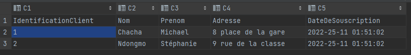
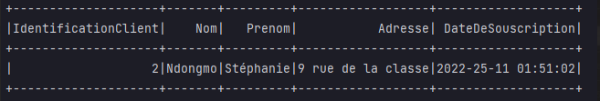
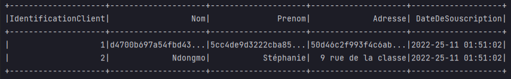

# ComplianceRGPD_NDONGMO_CHACHA

## Visualisation
### Fichier d'origine Avant le delete:


Dans ce projet, nous avons faire deux micro-services:
Le permier est Service1Delete: ici un l'utilisateur demande à ce que ces données personnelles soit supprimées et il nous fourni son id.
Par exemple id = 1 correspond à l'utilisateur Michael Chacha 
Pour ce fait, nous avons écrire un object Delete qui contient le chemin où se trouve le fichier csv contenant  les informations du client.
Nous avons implémenté un scénario dans lequel un utilisateur nous donne son numéro identifiant et ainsi nous pouvons à partir de cette information supprimé la ligne correspondant à ce ID.
Ensuite nous generons un fichier avec les données sauf la donnée supprimée
Enfin avec l'object mainDelete, nous executons l'object Delete

###Fichier après le delete:


Le deuxième est Service2Hacher: Un utilisateur souhaiterais que ces données reste confidentielles.
Dans ce cas, nous avons écrire une fonction Hacher qui permet de mettre en place les pratique pour hacher les données de chaque utilisateur de notre fichier csv en fonction de l'id de l'utilisateur.
Ensuite nous generons un fichier avec les données hachées
Enfin avec l'object mainHacher, nous executons l'object Hacher

### Fichier après le hachage


## Installation
Pour installer notre application, nous aurons besoin de:

- install JDK8 and SBT
- clone the project
- package l'application en exécutant la commande suivante à la racine du projet

```
sbt assembly
```